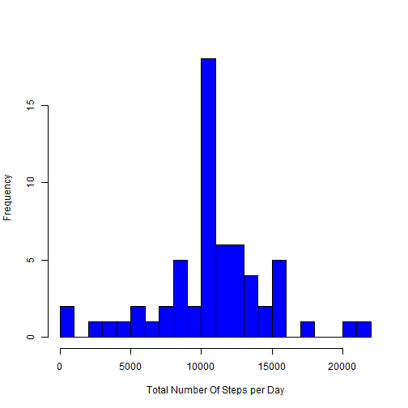

Reproducible Research: Peer Assessment 1
========================================


## Loading and preprocessing the data


```r
activity=read.csv("activity.csv")
```
Let us explor the original data

```r
summary(activity)
```

```
##      steps                date          interval     
##  Min.   :  0.00   2012-10-01:  288   Min.   :   0.0  
##  1st Qu.:  0.00   2012-10-02:  288   1st Qu.: 588.8  
##  Median :  0.00   2012-10-03:  288   Median :1177.5  
##  Mean   : 37.38   2012-10-04:  288   Mean   :1177.5  
##  3rd Qu.: 12.00   2012-10-05:  288   3rd Qu.:1766.2  
##  Max.   :806.00   2012-10-06:  288   Max.   :2355.0  
##  NA's   :2304     (Other)   :15840
```
It is clear that there is 2304 missing value

## What is mean total number of steps taken per day?

For this part of the assignment, the missing values is ignored as requested by the assignment


```r
activityWithOutMissingValues <- activity[complete.cases(activity),]
```
Let us explor the the  data after removing the missing values


```r
summary(activityWithOutMissingValues)
```

```
##      steps                date          interval     
##  Min.   :  0.00   2012-10-02:  288   Min.   :   0.0  
##  1st Qu.:  0.00   2012-10-03:  288   1st Qu.: 588.8  
##  Median :  0.00   2012-10-04:  288   Median :1177.5  
##  Mean   : 37.38   2012-10-05:  288   Mean   :1177.5  
##  3rd Qu.: 12.00   2012-10-06:  288   3rd Qu.:1766.2  
##  Max.   :806.00   2012-10-07:  288   Max.   :2355.0  
##                   (Other)   :13536
```

1.Calculate the total number of steps taken per day


```r
totalNumberOfStepsPerDay=aggregate(list(Sum=activityWithOutMissingValues$steps),by=list(Date=activityWithOutMissingValues$date),FUN=sum)
```
Let us  have a look at the results


```r
head(totalNumberOfStepsPerDay)
```

```
##         Date   Sum
## 1 2012-10-02   126
## 2 2012-10-03 11352
## 3 2012-10-04 12116
## 4 2012-10-05 13294
## 5 2012-10-06 15420
## 6 2012-10-07 11015
```
2.Make a histogram of the total number of steps taken each day


```r
hist(totalNumberOfStepsPerDay$Sum,col='blue',breaks=20,xlab = "Total Number Of Steps per Day",main = "")
```

 

3.Calculate and report the mean and median of the total number of steps taken per day


```r
mean_totalNumberOfStepsPerDay=mean(totalNumberOfStepsPerDay$Sum,na.rm = TRUE)
median_totalNumberOfStepsPerDay=median(totalNumberOfStepsPerDay$Sum,na.rm = TRUE)
```
* The mean is 


```r
mean_totalNumberOfStepsPerDay
```

```
## [1] 10766.19
```

* The median is :


```r
median_totalNumberOfStepsPerDay
```

```
## [1] 10765
```


## What is the average daily activity pattern?

1.Make a time series plot (i.e. type = "l") of the 5-minute interval (x-axis) and the average number of steps taken, averaged across all days (y-axis)


```r
meanOfStepsPerInterval=aggregate(list(steps=activity$steps),by=list(fiveMinuteInterval=activity$interval),FUN=mean,na.rm=TRUE)
plot(x=meanOfStepsPerInterval$fiveMinuteInterval,y=meanOfStepsPerInterval$steps,type="l",col='blue',xlab ="Five Minute Interval",ylab="Average Taken Steps")
grid()
```

 

2.Which 5-minute interval, on average across all the days in the dataset, contains the maximum number of steps?

```r
maxAverageSteps=max(meanOfStepsPerInterval$steps)

intervalContainMaxSteps=meanOfStepsPerInterval$fiveMinuteInterval[which.max(meanOfStepsPerInterval$steps)]
```

* The maximum average of steps is 206.17. 
* The 5-minute interval that contains the maximum number of steps is : 835. 

## Imputing missing values

1.Calculate and report the total number of missing values in the dataset (i.e. the total number of rows with NAs)


```r
missingValues=length(which(is.na(activity)))
```
The Number of missing values is :2304.


2.Filling in all of the missing values in the dataset

3.Create a new dataset that is equal to the original dataset but with the missing data filled in

 My strategy  for  missing values in the dataset is not  sophisticated I use  the mean for that day


```r
activityFilled=activity
activityFilled$steps[which(is.na(activityFilled$steps))] <- mean(activity$steps, na.rm = T)
```
4.Make a histogram of the total number of steps taken each day and Calculate and report the mean and median total number of steps taken per day


```r
totalNumberOfStepsPerDayForActivityFilled=aggregate(list(Sum=activityFilled$steps),by=list(Date=activityFilled$date),FUN=sum)
hist(totalNumberOfStepsPerDayForActivityFilled$Sum,col='blue',breaks=20,xlab = "Total Number Of Steps per Day",main = "")
```

 


```r
mean_totalNumberOfStepsPerDayForActivityFilled=mean(totalNumberOfStepsPerDayForActivityFilled$Sum,na.rm = TRUE)
median_totalNumberOfStepsPerDayForActivityFilled=median(totalNumberOfStepsPerDayForActivityFilled$Sum,na.rm = TRUE)
```
* The mean is 


```r
mean_totalNumberOfStepsPerDayForActivityFilled
```

```
## [1] 10766.19
```

* The median is :


```r
median_totalNumberOfStepsPerDayForActivityFilled
```

```
## [1] 10766.19
```

The filling of the missing data is slightly change the histogram however the median and the mean do not change that much.


## Are there differences in activity patterns between weekdays and weekends?

1.Create a new factor variable in the dataset with two levels - "weekday" and "weekend" indicating whether a given date is a weekday or weekend day.


```r
activityFilled$TypeOfTheDay <-  ifelse(as.POSIXlt(activityFilled$date)$wday %in% c(0,6), 'Weekend', 'Weekday')
```
2.Make a panel plot containing a time series plot (i.e. type = "l") of the 5-minute interval (x-axis) and the average number of steps taken, averaged across all weekday days or weekend days (y-axis). 


```r
averagedOfActivityFilled<- aggregate(steps ~ interval + TypeOfTheDay, data=activityFilled, mean)
```

```r
library(ggplot2)

ggplot(data=averagedOfActivityFilled, aes(x=interval, y=steps, group=TypeOfTheDay)) +geom_line(aes(color=TypeOfTheDay)) +facet_wrap(~ TypeOfTheDay, nrow=2)+ylab("Average Number of Steps")+xlab("Five-Minute Interval ")+theme_bw()
```

 

From the figures, there is more activity in weekends than the weekdays.
